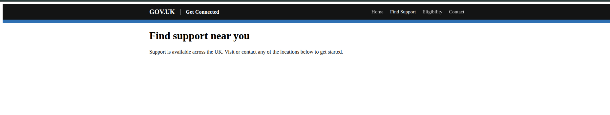
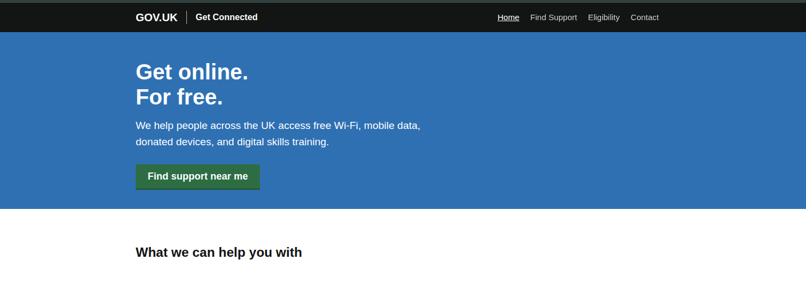

# Week 3
## Continue building the marketing website
<p>This week, we will continue to build the website, learn how to apply styles and add more content.</p>

### Open your existing folder
1. Visit https://vscode.dev
2. Click on Open Folder on the left hand panel<br><br>
<br><br>
3. Click on code-club-2026 (or the folder you created)

Note: When making changes to your files, reload the page on your browser to see the changes being applied on the code.

### Working with CSS
#### Styling the header
We are now going to style the header for the menu bar using CSS.
1. First thing to do is create a new file called style.css on the same directory as your .html files
2. Add a \<link> tag on the \<head> on each page
```html
<head>
    <meta charset="UTF-8">
    <meta name="viewport" content="width=device-width, initial-scale=1">
    <title>Get Connected – Free digital support for everyone</title>
    ...
    <link rel="stylesheet" href="style.css">
</head>
```
This will reference the link on your webpage to use CSS styles using the style.css file. The rel attribute is a way to tell the browser that this is a stylesheet.
3. Add the same \<link> tag on the other pages
4. Open style.css, and add this CSS class
```css
.container {
  
}
```
This is going to be used for some areas of the website where it can be references to be reused on HTML tags.
There are generally 2 ways to reference a CSS style on a stylesheet for HTML and that is using either 
- A class (.) which can be used for multiple HTML tags
- An id (#) which is only used for one HTML tag
#### Example
```css
.container {
    
}

#main-content {
    
}
```
This is the syntax used in CSS where the reference is defined by a prefix of a special character followed by the name of the style.
5. We are now going to add the properties or values of the styles
```css
.container {
    max-width: 960px;
    margin: 0 auto;
    padding: 0 20px;
}
```
- max-width is used to define the maximum width of the container using the values 960 pixels
- margin is used to define the spacing outside the box or container. The values auto are used for responsive values without using anything fixed or specifically defined values.
- padding is used for the spacing inside the container which has a fixed value of 20 pixels

See these links to understand spacing and units in CSS
- https://www.w3schools.com/css/css_margin.asp
- https://www.w3schools.com/css/css_padding.asp
- https://www.w3schools.com/cssref/css_units.php
6. We now add the remaining styles for the \<header>
```css
header {
  background: #0b0c0c;
  border-bottom: 10px solid #1d70b8;
}

header .container {
  display: flex;
  align-items: center;
  gap: 16px;
  flex-wrap: wrap;
  padding-top: 12px;
  padding-bottom: 12px;
}

.header-logo {
  color: #ffffff;
  font-size: 1.25rem;
  font-weight: 700;
  text-decoration: none;
}

.header-service {
  color: #ffffff;
  font-size: 1rem;
  font-weight: 700;
  border-left: 1px solid #b1b4b6;
  padding-left: 16px;
}

header nav {
  margin-left: auto;
  display: flex;
  gap: 20px;
  flex-wrap: wrap;
}

header nav a {
  color: #ffffff;
  text-decoration: none;
  font-size: 0.9375rem;
  opacity: 0.8;
}

header nav a:hover,
header nav a.active {
  color: #ffffff;
  opacity: 1;
  text-decoration: underline;
}
```
Some styles are defined like this
```css
.container {
    
}

header .container {
    
}
```
The first one defines all classes that have .container and the second one is a way to define values only for the .header and is used to add additional or override values to avoid affecting other styles on other HTML tags.

Styles like this refers to all \<header>, \<nav> and \<a> HTML tags
```css
header nav a {
    
}
```
The a:hover tags are for the links when hovered over. These are known as pseudo classes.
- See https://www.w3schools.com/cssref/sel_hover.php

Note: In coding, we use American English spelling by default when setting values. Such as
- Color
- Grey
- Initialize

Setting values to British spelling won't work.

### Binding HTML and CSS together
1. We can now apply the styles to the HTML tags. Open index.html and apply the following attributes which are the classes defined in the stylesheet
```html
<header>
    <div class="container">
        <a href="index.html" class="header-logo">GOV.UK</a>
        <span class="header-service">Get Connected</span>
        <nav>
            <a href="index.html" class="active">Home</a>
            <a href="support.html">Find Support</a>
            <a href="eligibility.html">Eligibility</a>
            <a href="contact.html">Contact</a>
        </nav>
    </div>
</header>
```
2. We have applied the CSS style classes. Now you can open index.html and see the results of the menu bar changes. 
3. You can now copy and paste this code to the other pages but make sure the class="active" attribute is applied on the correct \<a> tag. 

support.html
```html
<nav>
    <a href="index.html" >Home</a>
    <a href="support.html" class="active">Find Support</a>
    <a href="eligibility.html">Eligibility</a>
    <a href="contact.html">Contact</a>
</nav>
```

eligibility.html
```html
<nav>
    <a href="index.html" >Home</a>
    <a href="support.html">Find Support</a>
    <a href="eligibility.html" class="active">Eligibility</a>
    <a href="contact.html">Contact</a>
</nav>
```

contact.html
```html
<nav>
    <a href="index.html" >Home</a>
    <a href="support.html">Find Support</a>
    <a href="eligibility.html">Eligibility</a>
    <a href="contact.html" class="active">Contact</a>
</nav>
```
4. Open index.html, and you can see the changes on the other pages


5. The body the website has by default a margin applied. This is because it is a default styled applied by the browser. We can change this by doing following
```css
*, *::before, *::after {
    margin: 0;
    padding: 0;
}
```
These are more pseudo classes which applies to any HTML tag that's not defined with the stylesheet. Margin: 0 and Padding: 0 basically means don't apply margin and padding to any tags.
6. We can now apply the styles for the default font size.
```css
html {
    font-size: 16px;
}
```
7. Apply styles for the body
```css
body {
  font-family: Arial, sans-serif;
  font-size: 1rem;
  line-height: 1.5;
  color: #0b0c0c;
  background-color: #ffffff;
}
```
8. We can optimise the CSS stylesheets by adding a pseudo class called :root which we can store values that can be reused across the rest of the stylesheets instead of having to individually add these values for each class.
```css
:root {
  --black:       #0b0c0c;
  --white:       #ffffff;
  --blue:        #1d70b8;
  --blue-dark:   #003078;
  --green:       #00703c;
  --green-dark:  #005a30;
  --yellow:      #ffdd00;
  --light-grey:  #f3f2f1;
  --mid-grey:    #b1b4b6;
  --dark-grey:   #505a5f;
  --red:         #d4351c;
  --orange:      #f47738;
  --purple:      #4c2c92;
  --font:        Arial, sans-serif;
  --max-width:   960px;
}

```
9. We can now replace the values to reuse and reference these variables. Use var(--font) or var(--black) to reference the custom value
```css
body {
    font-family: var(--font);
    font-size: 1rem;
    line-height: 1.5;
    color: var(--black);
    background-color: var(--white);
}
```
10. You can now replace your existing styles with this
```css
/* --- Layout --- */
.container {
  max-width: var(--max-width);
  margin: 0 auto;
  padding: 0 20px;
}

/* ---- Header ---- */
header {
  background-color: var(--black);
  border-bottom: 10px solid var(--blue);
}

header .container {
  display: flex;
  align-items: center;
  gap: 16px;
  flex-wrap: wrap;
  padding-top: 12px;
  padding-bottom: 12px;
}

.header-logo {
  color: var(--white);
  font-size: 1.25rem;
  font-weight: 700;
  text-decoration: none;
}

.header-service {
  color: var(--white);
  font-size: 1rem;
  font-weight: 700;
  border-left: 1px solid var(--mid-grey);
  padding-left: 16px;
}

header nav {
  margin-left: auto;
  display: flex;
  gap: 20px;
  flex-wrap: wrap;
}

header nav a {
  color: var(--white);
  text-decoration: none;
  font-size: 0.9375rem;
  opacity: 0.8;
}

header nav a:hover,
header nav a.active {
  color: var(--white);
  opacity: 1;
  text-decoration: underline;
}
```
### Hero banner
1. We can now add the hero banner or container on index.html. This will be placed under the \<header> tag

```html
<div class="hero">
    <div class="container">
        <h1>Get online.<br>For free.</h1>
        <p>We help people across the UK access free Wi-Fi, mobile data, donated devices, and digital skills
            training.</p>
        <a href="support.html" class="btn btn--start">
            Find support near me
        </a>
    </div>
</div>
```
2. Add the styles for this
```css
.hero {
  background-color: var(--blue);
  padding: 40px 0 35px;
}

.hero h1 { color: var(--white); margin-bottom: 15px; }
.hero p  { color: var(--white); font-size: 1.1875rem; max-width: 560px; margin-bottom: 25px; }
```

### Typography and spacing
For the remaining CSS styles of the typography and spacing for the main container, you can add these styles
```css
main {
  padding: 30px 0 60px;
}

/* --- Typography --- */
h1 { font-size: 2.5rem; font-weight: 700; line-height: 1.15; margin-bottom: 20px; }
h2 { font-size: 1.5rem;   font-weight: 700; line-height: 1.25; margin-bottom: 15px; margin-top: 35px; }
h3 { font-size: 1.125rem; font-weight: 700; line-height: 1.3;  margin-bottom: 10px; margin-top: 25px; }

p  { margin-bottom: 15px; line-height: 1.6; }
a  { color: var(--blue); }
a:hover { color: var(--blue-dark); }

.lead { font-size: 1.1875rem; color: var(--dark-grey); margin-bottom: 25px; }

hr {
  border: none;
  border-top: 1px solid var(--mid-grey);
  margin: 30px 0;
}
```

### Button styles
For the button styles, add these
```css
.btn {
  display: inline-block;
  background-color: var(--green);
  color: var(--white);
  font-family: var(--font);
  font-size: 1rem;
  font-weight: 700;
  padding: 10px 18px 9px;
  border: none;
  border-bottom: 3px solid var(--green-dark);
  text-decoration: none;
  cursor: pointer;
  line-height: 1.2;
}

.btn:hover { background-color: var(--green-dark); color: var(--white); text-decoration: none; }
.btn:focus { outline: 3px solid var(--yellow); outline-offset: 0; }

.btn--start {
  font-size: 1.125rem;
  padding: 12px 22px 11px;
  display: inline-flex;
  align-items: center;
  gap: 10px;
}

.btn--secondary {
  background-color: var(--light-grey);
  color: var(--black);
  border-bottom-color: var(--mid-grey);
}
.btn--secondary:hover { background-color: var(--light-grey); color: var(--black); }
```
You can now see that the styles for the hero, main container and button have been applied.



### The footer
1. You can add this to each page after the \</main> tag and before the \</body> tag

```html
<footer>
    <div class="container">
        <ul class="footer-links">
            <li><a href="#">Privacy</a></li>
            <li><a href="#">Cookies</a></li>
            <li><a href="contact.html">Contact</a></li>
            <li><a href="#">Accessibility</a></li>
        </ul>
        <p class="footer-meta">
            All content is available under the
            <a href="https://www.nationalarchives.gov.uk/doc/open-government-licence/version/3/">Open Government Licence
                v3.0</a>
            &copy; Crown copyright
        </p>
    </div>
</footer>
```
2. For the CSS, apply these
```css
footer {
  background-color: var(--light-grey);
  border-top: 1px solid var(--mid-grey);
  padding: 25px 0;
  margin-top: 40px;
}

.footer-links {
  list-style: none;
  display: flex;
  gap: 20px;
  flex-wrap: wrap;
  margin-bottom: 12px;
}

.footer-links a {
  color: var(--blue);
  font-size: 0.875rem;
}

.footer-meta {
  font-size: 0.875rem;
  color: var(--dark-grey);
  display: flex;
  align-items: center;
  gap: 8px;
  flex-wrap: wrap;
}

.footer-meta a { color: var(--blue); }
```
### Breadcrumbs
1. For the breadcrumbs, apply these to eligibility.html, support.html and contact.html. Any page other than index.html. Apply this after the \<header> tag and before the \<main> tag.

eligibility.html
```html
<nav class="breadcrumb">
    <div class="container">
        <ol>
            <li><a href="index.html">Home</a></li>
            <li aria-current="page">Eligibility</li>
        </ol>
    </div>
</nav>
```
support.html
```html
<nav class="breadcrumb">
    <div class="container">
        <ol>
            <li><a href="index.html">Home</a></li>
            <li aria-current="page">Find Support</li>
        </ol>
    </div>
</nav>
```
contact.html
```html
<nav class="breadcrumb">
    <div class="container">
        <ol>
            <li><a href="index.html">Home</a></li>
            <li aria-current="page">Contact</li>
        </ol>
    </div>
</nav>
```

and then apply the styles to this

```css
.breadcrumb {
  padding: 10px 0;
  border-bottom: 1px solid var(--mid-grey);
  font-size: 0.875rem;
}

.breadcrumb ol {
  list-style: none;
  display: flex;
  gap: 6px;
  flex-wrap: wrap;
}

.breadcrumb li + li::before {
  content: "›";
  color: var(--mid-grey);
  margin-right: 6px;
}

```
