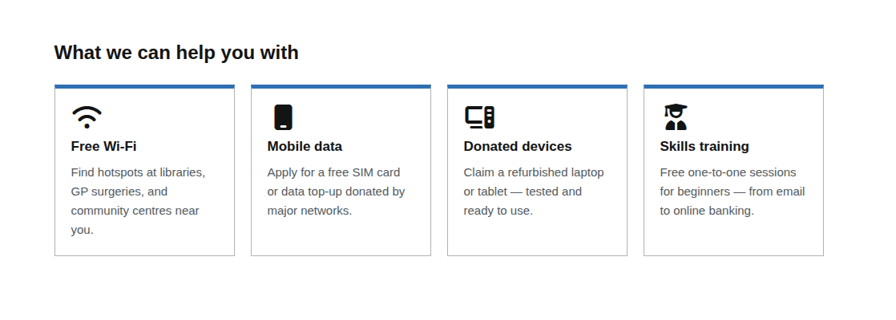
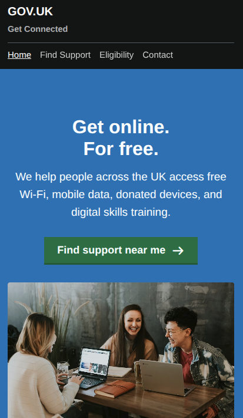
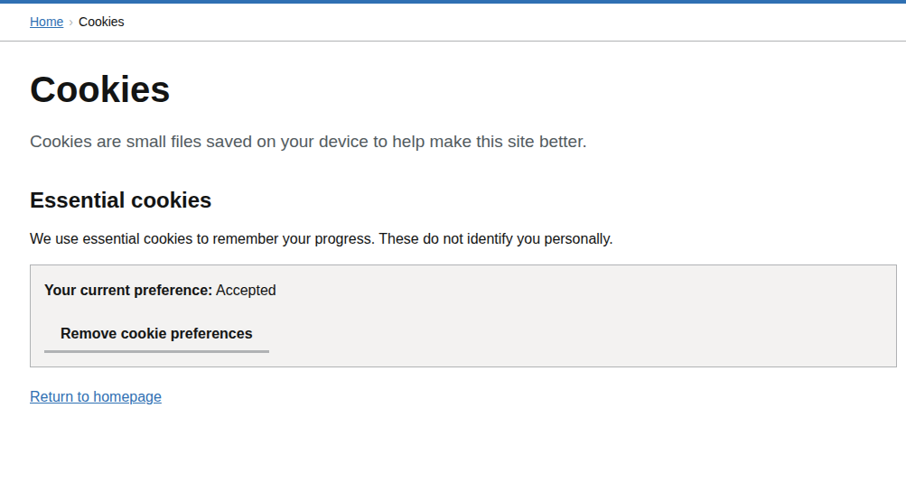

# Week 4
## Complete the marketing website
This is an exercise continued on from week 3: https://github.com/Government-Communication-Service/code-club-2026/tree/week-3
<p>This week, we will finish building the website using HTML, CSS and JavaScript.</p>

## Contents


### Open your existing folder
1. Visit https://vscode.dev
2. Click on Open Folder on the left hand panel<br><br>
<br><br>
3. Click on code-club-2026 (or the folder you created)

Note: When making changes to your files, reload the page or file on your browser to see the changes being applied from the code changes.

### Add the remaining content
#### Card Grid
The card grid will be the links to the support page with anchor links that jump to the content when clicked instead of the top of the page.

Add this in index.html under the \<h2>What we can help you with\</h2> tag.
```html
<h2>What we can help you with\</h2>

<div class="card-grid">
    <a href="support.html#wifi" class="card">
        <i class="fa-solid fa-wifi card-icon"></i>
        <div class="card-heading ">Free Wi-Fi</div>
        <p class="card-body">Find hotspots at libraries, GP surgeries, and community centres near you.</p>
    </a>
    <a href="support.html#data" class="card">
        <i class="fa-solid fa-mobile card-icon"></i>
        <div class="card-heading">Mobile data</div>
        <p class="card-body">Apply for a free SIM card or data top-up donated by major networks.</p>
    </a>
    <a href="support.html#devices" class="card">
        <i class="fa-solid fa-computer card-icon"></i>
        <div class="card-heading">Donated devices</div>
        <p class="card-body">Claim a refurbished laptop or tablet — tested and ready to use.</p>
    </a>
    <a href="support.html#training" class="card">
        <i class="fa-solid fa-user-graduate card-icon"></i>
        <div class="card-heading ">Skills training</div>
        <p class="card-body">Free one-to-one sessions for beginners — from email to online banking.</p>
    </a>
</div>
```

Then add the styles for this

```css
.card-grid {
  display: grid;
  grid-template-columns: repeat(auto-fit, minmax(200px, 1fr));
  gap: 20px;
  margin: 25px 0 30px;
}

.card {
  border: 1px solid var(--mid-grey);
  border-top: 5px solid var(--blue);
  padding: 20px;
  text-decoration: none;
  color: var(--black);
  display: block;
}

.card:hover { box-shadow: 0 3px 10px rgba(0,0,0,0.12); color: var(--black); text-decoration: none; }

.card-icon    { font-size: 2rem; display: block; margin-bottom: 8px; }
.card-heading { font-size: 1.0625rem; font-weight: 700; margin: 0 0 8px; display: block; }
.card-body    { font-size: 0.9375rem; color: var(--dark-grey); margin: 0; }
```


The 4 card links will then go to the support page and scroll to the content which we will add later.

#### Inset text
We can add an inset text to give important information to the user

Add this below the card grid
```html
<div class="inset">
    <p>You do not need to register or prove eligibility to use free Wi-Fi or attend training sessions. Just turn up.</p>
</div>

```
Add the style for this
```css
.inset {
  border-left: 8px solid var(--blue);
  padding: 15px 20px;
  margin: 20px 0;
  background: var(--white);
}

.inset p:last-child { margin-bottom: 0; }
```


And then the final piece for the home page, a button link to the eligibility page below the inset text.
```html
<p>Not sure if you qualify for a device or data SIM?</p>
<a href="eligibility.html" class="btn btn--secondary">Check your eligibility</a>
```

### Support page
#### List and tags

Over to the support page, we can add an unordered list which becomes like a bullet point list. 

```html
<ul class="results-list">
    <li class="result-item">
      <strong class="tag tag--green">Wi-Fi</strong>
      <div>
        <p class="result-title">Rutherglen Library</p>
        <p class="result-detail">163 Main Street – Open Mon–Fri 9am–8pm</p>
      </div>
    </li>
    <li class="result-item">
      <strong class="tag">Data</strong>
      <div>
        <p class="result-title">O2 Community Data Grant</p>
        <p class="result-detail">Free 3GB SIM for eligible residents – apply online</p>
      </div>
    </li>
    <li class="result-item">
      <strong class="tag tag--orange">Device</strong>
      <div>
        <p class="result-title">South Side Device Hub</p>
        <p class="result-detail">Govanhill Community Centre – 8 devices available</p>
      </div>
    </li>
    <li class="result-item">
      <strong class="tag tag--purple">Training</strong>
      <div>
        <p class="result-title">Digital Drop-in – Thursdays 10am</p>
        <p class="result-detail">Mitchell Library – free, no booking needed</p>
      </div>
    </li>
</ul>
```
We then want to add the styles to use tags to replace the default bullet style of the list

```css
.tag {
    display: inline-block;
    background: var(--blue);
    color: var(--white);
    font-size: 0.75rem;
    font-weight: 700;
    letter-spacing: 0.5px;
    text-transform: uppercase;
    padding: 3px 8px;
    white-space: nowrap;
}

.tag--green  { background: var(--green); }
.tag--orange { background: var(--orange); }
.tag--purple { background: var(--purple); }

.results-list { list-style: none; margin: 15px 0 0; }

.result-item {
  display: flex;
  align-items: flex-start;
  gap: 15px;
  padding: 15px 0;
  border-bottom: 1px solid var(--mid-grey);
}

.result-item:first-child { border-top: 1px solid var(--mid-grey); }

.result-item .tag { flex-shrink: 0; margin-top: 3px; }

.result-title  { font-weight: 700; font-size: 1rem; margin-bottom: 4px; }
.result-detail { font-size: 0.9375rem; color: var(--dark-grey); margin: 0; }
```

You can find more information about lists on HTML here
- https://www.w3schools.com/html/html_lists.asp

#### Anchor link targets
We can now add more content to be used for the anchor links on index.html that are targeted to be scrolled to these items automatically.

The id on the tags are the reference used to support the link using the hashtag such as 
- support.html#wifi
- support.html#data
- support.html#devices
- support.html#training

```html
<h2>What's available</h2>

<h3 id="wifi"><i class="fa-solid fa-wifi"></i> Free Wi-Fi</h3>
<p>Find hotspots at libraries, GP surgeries, Jobcentres, and community centres. No sign-up needed at most locations.</p>

<h3 id="data"><i class="fa-solid fa-mobile"></i> Free mobile data</h3>
<p>Donated SIM cards and top-ups from major networks. <a href="eligibility.html">Check if you qualify.</a></p>

<h3 id="devices"><i class="fa-solid fa-computer"></i> Donated devices</h3>
<p>Refurbished laptops and tablets, wiped and tested. Available to eligible individuals with a 90-day guarantee.</p>

<h3 id="training"><i class="fa-solid fa-user-graduate"></i> Digital skills training</h3>
<p>Free sessions with trained Digital Champions — from switching on a device to using online banking.</p>
```

If you now navigate to the home page or index.html and click on one of the cards, it will then take you to support page then jumps or scrolls to that specific content where it is referenced.

### Eligibility page
We can now add another 2 lists for the eligibility page for more content

```html
<h1>Check your eligibility</h1>
<p class="lead">Some services are open to everyone. Others are for people who meet certain criteria.</p>

<h2>Open to everyone</h2>
<p>You do not need to prove anything to access these:</p>
<ul>
    <li>Free Wi-Fi at libraries, GP surgeries, and community centres</li>
    <li>Digital skills training sessions and drop-ins</li>
</ul>

<h2>You may qualify for a device or data SIM if you</h2>
<ul>
    <li>Receive Universal Credit, PIP, Pension Credit, or Jobseeker's Allowance</li>
    <li>Are a care leaver aged 16–25</li>
    <li>Are in temporary or supported accommodation</li>
    <li>Are a registered carer</li>
    <li>Are referred by a social worker, GP, or key worker</li>
</ul>

<div class="inset">
    <p>If you are not sure whether you qualify, <a href="contact.html">contact us</a> — we will try to help regardless.</p>
</div>

<hr>
```

You can use a horizontal line separator \<hr>

For the last piece, we can add a warning text
```html
<div class="warning">
    <i class="fa-solid fa-circle-exclamation fa-2x"></i>
    <strong>You will never be turned away without someone trying to help you first.</strong>
</div>
```
Add this for the alignment of text
```css
.warning {
  display: flex;
  align-items: flex-start;
  gap: 12px;
  font-weight: 700;
  font-size: 1rem;
  margin: 20px 0;
}
```

### Contact page
For the last page, we're just going to fill in some information for this page

```html
<h2>Email</h2>
<p><a href="mailto:hello@getconnected.gov.uk">hello@getconnected.gov.uk</a></p>
<p>We aim to respond within 3 working days.</p>

<h2>Telephone</h2>
<p><strong>0800 123 4567</strong> (free from UK mobiles and landlines)</p>
<p>Open Monday to Friday, 9am to 5pm.</p>

<h2>Visit in person</h2>
<p>You can get face-to-face help at any of our partner locations, including libraries and community centres. <a href="support.html">Find a location near you.</a></p>

<div class="inset">
    <p>If you need urgent help getting online — for example to access NHS services — call your local council or visit your nearest library.</p>
</div>
```

### Smaller screens styles
We can update the styles to add responsive design styles for smaller screens

```css
@media (max-width: 768px) {
  
  h1 { font-size: 2rem; }
  h2 { font-size: 1.25rem; }
  .lead { font-size: 1.1rem; }

  header .container {
    flex-direction: column;
    align-items: flex-start;
    gap: 10px;
  }

  .header-service {
    border-left: none;
    padding-left: 0;
    margin-top: -5px;
    font-size: 0.9rem;
    color: var(--mid-grey);
  }

  header nav {
    margin-left: 0;
    width: 100%;
    gap: 15px;
    padding-top: 10px;
    border-top: 1px solid var(--dark-grey);
  }

  .hero .container {
    flex-direction: column;
    min-height: auto;
    padding: 0 20px;
  }

  .hero-text {
    padding: 30px 0;
    text-align: center;
  }

  .hero-text p {
    margin-left: auto;
    margin-right: auto;
  }

  .hero-image {
    width: 100%;
    height: 250px;
    border-radius: 4px;
    margin-bottom: 20px;
  }

  .card-grid {
    grid-template-columns: 1fr;
  }

  .result-item {
    flex-direction: column;
    gap: 8px;
  }

  .result-item .tag {
    align-self: flex-start;
  }

  .footer-links {
    flex-direction: column;
    gap: 10px;
  }

  .footer-meta {
    flex-direction: column;
    align-items: flex-start;
  }
}

@media (max-width: 480px) {
  .btn--start {
    justify-content: center;
  }
  
  .breadcrumb ol {
    font-size: 0.8rem;
  }
}
```


### Cookie banner
Last thing we want to add for demonstration purposes is to add a cookie banner to save the preference of the user.

- Create a script.js file which will be used for the JavaScript functions. 
- Then add this into every HTML page in the \<head></head>.

```html
<title>Get Connected – Free digital support for everyone</title>
<link rel="stylesheet" href="style.css">
<link rel="stylesheet" href="https://cdnjs.cloudflare.com/ajax/libs/font-awesome/7.0.1/css/all.min.css">

<script src="script.js" defer></script>
```
Then add the functions in script.js. This will be used to trigger the cookie banner and to check if it has been opted in or not. 
```js

document.addEventListener("DOMContentLoaded", function() {
    const banner = document.getElementById('cookie-banner');
    const statusElement = document.getElementById('opt-status');

    if (banner && !localStorage.getItem('cookies-accepted')) {
        banner.style.display = 'block';
    }

    if (statusElement) {
        const isAccepted = localStorage.getItem('cookies-accepted');
        statusElement.innerText = isAccepted ? "Accepted" : "Not set";
    }
});

function acceptCookies() {
    localStorage.setItem('cookies-accepted', 'true');
    const banner = document.getElementById('cookie-banner');
    if (banner) {
        banner.style.display = 'none';
    }
}

function clearCookies() {
    localStorage.removeItem('cookies-accepted');
    alert('Your preferences have been cleared.');
    window.location.reload();
}
```
Add this to every page for the banner to show up. Add this after the \<body> tag.

```html
<div id="cookie-banner" class="cookie-banner">
    <div class="container">
        <h2>Cookies on Get Connected</h2>
        <p>We use some essential cookies to make this service work.</p>
        <div class="button-group">
            <button class="btn" onclick="acceptCookies()">Accept essential cookies</button>
            <a href="cookies.html" class="btn btn--secondary">View cookies</a>
        </div>
    </div>
</div>
```
And add the styles for this
```css
.cookie-banner {
    background-color: var(--light-grey);
    border-bottom: 10px solid var(--blue);
    padding: 20px 0;
    display: none;
}

.cookie-banner h2 { margin-top: 0; font-size: 1.1875rem; }
.cookie-banner .button-group { display: flex; gap: 15px; margin-top: 15px; }

.cookie-status {
    padding: 15px;
    background: var(--light-grey);
    border: 1px solid var(--mid-grey);
    margin-bottom: 20px;
}
```

We also need a page for to remove the preference. Create a cookie.html file then copy and paste this into the page.

```html
<!DOCTYPE html>
<html lang="en">
<head>
    <meta charset="UTF-8">
    <meta name="viewport" content="width=device-width, initial-scale=1">
    <title>Cookies – Get Connected</title>
    <link rel="stylesheet" href="style.css">
    <link rel="stylesheet" href="https://cdnjs.cloudflare.com/ajax/libs/font-awesome/7.0.1/css/all.min.css">
    <script src="script.js" defer></script>
</head>
<body>
<div id="cookie-banner" class="cookie-banner">
    <div class="container">
        <h2>Cookies on Get Connected</h2>
        <p>We use some essential cookies to make this service work.</p>
        <div class="button-group">
            <button class="btn" onclick="acceptCookies()">Accept essential cookies</button>
            <a href="cookies.html" class="btn btn--secondary">View cookies</a>
        </div>
    </div>
</div>


<header>
    <div class="container">
        <a href="index.html" class="header-logo">GOV.UK</a>
        <span class="header-service">Get Connected</span>
        <nav>
            <a href="index.html">Home</a>
            <a href="support.html">Find Support</a>
            <a href="eligibility.html">Eligibility</a>
            <a href="contact.html">Contact</a>
        </nav>
    </div>
</header>

<nav class="breadcrumb">
    <div class="container">
        <ol>
            <li><a href="index.html">Home</a></li>
            <li aria-current="page">Cookies</li>
        </ol>
    </div>
</nav>

<main id="main-content">
    <div class="container">
        <h1>Cookies</h1>
        <p class="lead">Cookies are small files saved on your device to help make this site better.</p>

        <h2>Essential cookies</h2>
        <p>We use essential cookies to remember your progress. These do not identify you personally.</p>

        <div class="cookie-status">
            <p><strong>Your current preference:</strong> <span id="opt-status">Loading...</span></p>
            <button class="btn btn--secondary" onclick="clearCookies()">Remove cookie preferences</button>
        </div>

        <p><a href="index.html">Return to homepage</a></p>

    </div>
</main>

<footer>
    <div class="container">
        <ul class="footer-links">
            <li><a href="#">Privacy</a></li>
            <li><a href="#">Cookies</a></li>
            <li><a href="contact.html">Contact</a></li>
            <li><a href="#">Accessibility</a></li>
        </ul>
        <p class="footer-meta">
            All content is available under the
            <a href="https://www.nationalarchives.gov.uk/doc/open-government-licence/version/3/">Open Government Licence
                v3.0</a>
            &copy; Crown copyright
        </p>
    </div>
</footer>

</body>
</html>

```




### Finishing touches
#### Footer
You can also update the links on the footer for that cookies.html page. Apply this for all other pages
```html
<ul class="footer-links">
    <li><a href="#">Privacy</a></li>
    <li><a href="cookies.html">Cookies</a></li>
    <li><a href="contact.html">Contact</a></li>
</ul>

```
#### Menu link hover
Add this for header logo. The logo is also a link and uses the same styles as other links when hover 
```css
.header-logo:hover {
  color: var(--white);
}
```
#### For accessibility and for screen readers
We need to update the icons on HTML to avoid confusing screen reader technology. Add aria-hidden=true to the icons
```html
<i class="fa-solid fa-wifi card-icon" aria-hidden="true"></i>
```

Do read up on accessibility and why it's important to use for websites
- https://www.w3schools.com/accessibility/

### End of course
That's the end of the course. You can also have a look at publishing the website using GitHub pages: https://docs.github.com/en/pages/getting-started-with-github-pages/creating-a-github-pages-site
