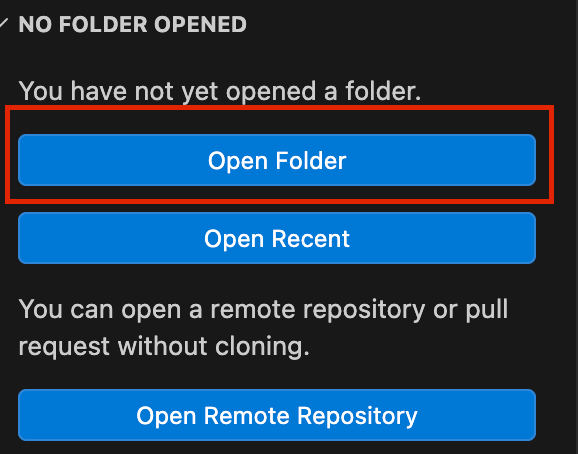
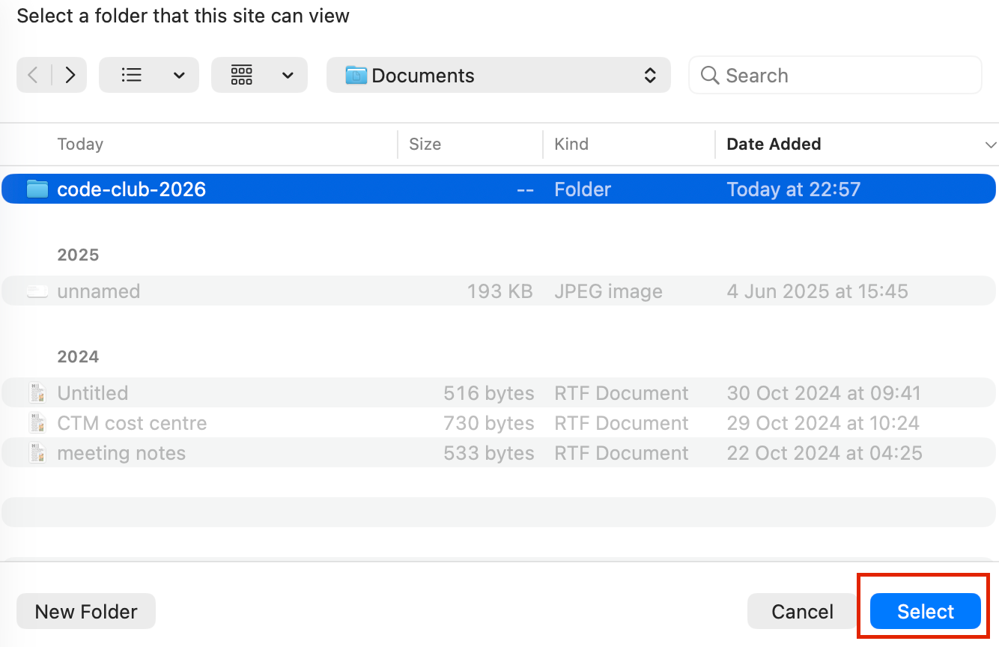
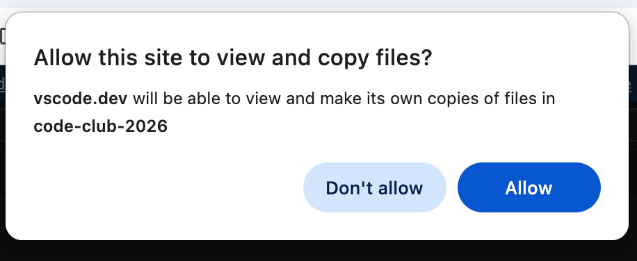
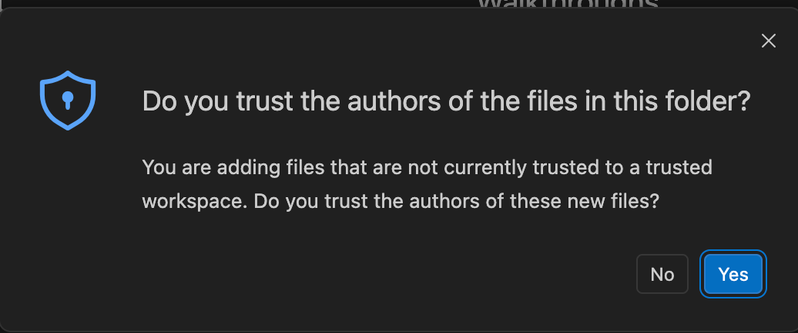
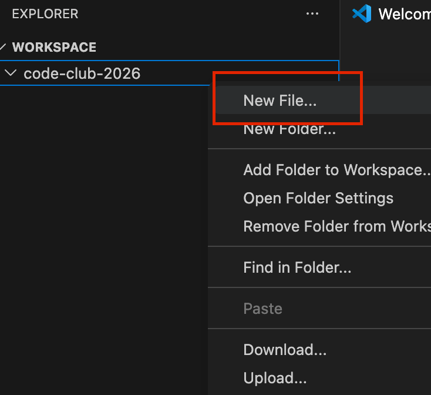
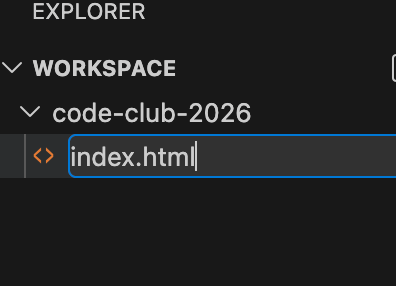

# Week 2
## Build the marketing website
<p>This week, we will start to build the website from scratch and learn how to use HTML</p>
<p>You can follow the instructions below to get started.</p>

### Getting Started
1. Visit https://vscode.dev
2. Click on Open Folder on the left hand panel<br><br>
<br><br>
3. Create a new folder and name it something like code-club-2026 or anything you like, then on that folder click the select button
VS Code will then use this<br><br>
<br><br>
4. You may receive permission popups, click allow or yes when they appear<br><br>


5. The folder will now appear on your workspace area which will have your website files placed in there
6. Right-click on the code-club-2026 folder and create a new file<br><br>
<br><br>
7. Add the first HTML file<br><br>


On VS Code, when closing your browser, your workspace and files will be removed but your files will still be on your device. Repeat steps 2, 3 and 4 to see your files again.
### Working with HTML

<p>We are going to build 4 pages for this and add the HTML tags on the web pages.</p>
<p>Note: Make sure to save the files each time code has been added or edited (Ctrl+S or Command+S)</p>
<p>Starting with index.html</p>

#### Base Template
1. Add the base HTML template that is to be used for all pages.
```html
<!DOCTYPE html>
<html>

    <head>
        
    </head>

    <body>
    
    </body>

</html>
```
Tags within the \<head> are used for metadata such as SEO or information used for non-content purposes. Tags within \<body> used for all content purposes.
2. Add these HTML tags for the \<head>
```html
<head>
    <meta charset="UTF-8">
    <meta name="viewport" content="width=device-width, initial-scale=1">
    <title>Get Connected – Free digital support for everyone</title>
</head>
```
- \<title> is used for 
- The viewport tag is used for responsive design for smaller screens such as mobile and tablet
- The charset is used to display special characters on the web page correctly. UTF-8 is the most used character set on the World Wide Web.
3. Add these HTML tags for the \<body>
```html
<body>
    <header>
        
    </header>
    
    <main>
        
    </main>
    
    <footer>
        
    </footer>
</body>

```
These tags will be main template used across all pages. These tags are also used to define areas of the website for search engines to learn how the website is structured.
- \<header> is used mostly for the top menu bar
- \<main> is used for the main or central part the web pages
- \<footer> is used like an extra menu bar for links but is displayed at the bottom
4. Within the \<header>, add the menu bar link that will be used for all pages
```html
<header>
    <div>
        <a href="index.html">GOV.UK</a>
        <span>Get Connected</span>
        <nav>
            <a href="index.html">Home</a>
            <a href="support.html">Find Support</a>
            <a href="eligibility.html">Eligibility</a>
            <a href="contact.html">Contact</a>
        </nav>
    </div>
</header>
```
- \<div> is a very common tag used to create a custom block or box on a web page. It's used mostly for styling a collection of tags. This will be used to style the contents of the menu bar.
- \<a> tags are used for links to click on that take you to another web page or website. The href attributes are the links defined. In this case, it will be the HTML files within the website. 
- \<span> is mainly used for inline text that is part of a sentence, but we might want to style it differently from the rest of the sentence or paragraph.
- \<nav> is used to define the navigation of links. This is used for navigating between pages of the website.
5. The other links contain files that don't exist yet. We should now create in the same directory as index.html
- support.html
- eligibility.html
- contact.html
6. Add the \<main> content
```html
<main>
    <div>
        <h1>What we can help you with</h1>
    </div>
</main>
```
7. Copy all the contents of index.html and paste them in each of the newly created .html files
8. The menu bar and main container can be used across different web pages. Change the contents of each page to see different content
9. For support.html, change the content to this
```html
<title>Find Support – Get Connected</title>
...
<main>
    <div>
        <h1>Find support near you</h1>
        <p>Support is available across the UK. Visit or contact any of the locations below to get
            started.</p>
    </div>
</main>
```
10. For eligibility.html
```html
<title>Check Eligibility – Get Connected</title>
...
<main>
    <div>
        <h1>Check your eligibility</h1>
        <p>Some services are open to everyone. Others are for people who meet certain criteria.</p>
    </div>
</main>
```
11. For contact.html
```html
<title>Contact – Get Connected</title>
...
<main>
    <div>
        <h1>Contact us</h1>
        <p>Get in touch if you need help finding support or have feedback about this service.</p>
    </div>
</main>
```
12. Open index.html and you can see the content displayed like this with the links on the menu which you can navigate through. We will now start adding styles to the header or menu bar.


We can now start to style the website using CSS. You find this stage on week 3: https://github.com/Government-Communication-Service/code-club-2026/tree/week-3

